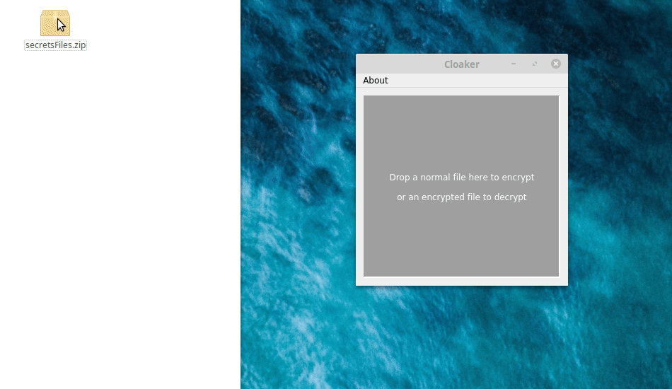

# Cloaker

Ready-to-use downloads on the [Releases](https://github.com/spieglt/Cloaker/releases) page

**Version 2.0 improvements:** added automatic mode detection, removed Encrypt and Decrypt buttons, deleted Windows MFC GUI in favor of statically-linked Qt on all 3 platforms.

### Very simple cross-platform file encryption

Have you ever wanted to protect a file with a password and found it unnecessarily difficult to do so? Cloaker aims to provide the most straightforward file encryption possible. Just drop a file onto the window, set a password, and choose where to save it. To decrypt, drop the encrypted file on the window, enter the password, and choose the output location. (Tip: decrypt to a ramdisk for temporary use to avoid writing data to permanent storage.) No installation required! On Windows it's a single `.exe`, on Mac a standard `.app` bundle, and on Linux a single executable `.run` file.



**Data Loss Disclaimer:** if you lose or forget your password, **your data cannot be recovered!** Use a password manager or another secure form of backup. Cloaker uses stream encryption from the sodium-oxide Rust wrapper of libsodium (xchacha20poly1305).

# Compilation instructions:
`cd adapter && cargo build && cargo build --release`. 

Then open `gui/cloaker/cloaker.pro` in Qt Creator (Qt 5.12), make sure kit is 64bit, and build.

If you want to make a distributable on... 

**Mac:** use `macqtdeploy` with the built .app bundle as argument. 

**Linux only:** compile a static version of Qt with something like:

(Mint 19 example)
```
$ mkdir ~/qt-static && cd ~/qt-static
$ ~/Qt/5.12.3/Src/configure -prefix ~/qt-static/5.12.3 -static -release -opensource -confirm-license -skip multimedia -no-compile-examples -nomake examples -no-openssl -no-libpng -skip wayland -qt-xcb
$ make
```

(Ubuntu 19.04 example, you'll probably have to install extra fontconfig and freetype dependencies)
```
$ mkdir ~/qt-static && cd ~/qt-static
$ mkdir build install; cd build
$ ~/Qt/5.13.0/Src/configure -static -release -prefix ~/qt-static/install -opensource -confirm-license -skip multimedia -skip webengine -no-compile-examples -nomake examples -no-openssl -no-libpng -skip wayland -fontconfig -ico -gtk
$ make -j8
```

**Windows only:** compile Qt statically with something like:
```
> cd c:\; mkdir qt-static; cd qt-static
> C:\Qt\5.12.0\Src\configure.bat -prefix C:\qt-static\5.12.0 -static -release -opensource -confirm-license -skip multimedia -no-compile-examples -nomake examples -no-openssl -no-opengl
> mingw32-make.exe
```

Then run `rustup toolchain install stable-x86_64-pc-windows-gnu` and `rustup set default-host x86_64-pc-windows-gnu`. (Linking Qt statically requires compiling with MinGW, which requires linking against Rust libs compiled with MinGW.) Then `cd` to `cloaker\adapter`, delete the `target` directory, run `cargo build --release` again, go into the new `target\release` directory, and rename `adapter.lib` to `libadapter.a`. (https://github.com/rust-lang/rust/issues/43749)

**Then, on Linux and Windows:** go to Qt Creator settings, add a new version of Qt, and point to `wherever/it/is/qt-static/qtbase/bin/qmake`. Then add a new "Kit" that points to this Qt version, and build Release version with that kit selected. (Use your preexisting dynamically-linked version of Qt for debugging.)

# Planned features:
- Progress indicator/speed staticstics?
- CLI: add password length requirement, and a real flag parser with an output parameter
- Mobile version someday?

# Issues:
- Tell me about them
- Backward compatibility note: to decrypt a file made with version 1.0 or 1.1 of Cloaker (with Encrypt and Decrypt buttons), the filename must end with the ".cloaker" extension. Files encrypted with later versions are not subject to this restriction.

If you've used Cloaker, please send me feedback and thank you for your interest!

**You might also like:** https://github.com/spieglt/flyingcarpet

