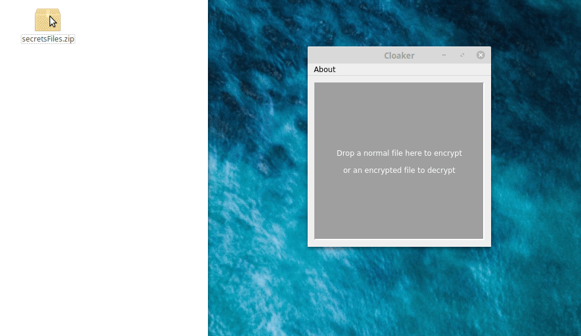

# Cloaker

**New Cloaker 5.0 downloads on the [Releases](https://github.com/spieglt/Cloaker/releases) page!**

**Mobile version available at https://cloaker.mobi! Static HTML/CSS/JS/WASM and interoperable with this version of Cloaker.** [Code here.](https://github.com/spieglt/Cloaker.js)

## Very simple cross-platform file encryption

Have you ever wanted to protect a file with a password and found it unnecessarily difficult to do so? Cloaker aims to provide the most straightforward file encryption possible. Just drop a file onto the window, set a password, and choose where to save it. To decrypt, drop the encrypted file on the window, enter the password, and choose the output location. No installation required: on Windows it's a single `.exe`, on Mac an `.app` bundle, and on Linux an executable `.AppImage` file.



**Data Loss Disclaimer:** if you lose or forget your password, **your data cannot be recovered!** Use a password manager or another secure form of backup.

Cloaker's file format is [libsodium](https://doc.libsodium.org/)'s: XChaCha20-Poly1305 `secretstream` for the data, with the key derived by `crypto_pwhash` (Argon2id, interactive limits). Since version 5.0 the implementation is pure Rust — [dryoc](https://github.com/brndnmtthws/dryoc) for the secretstream and [RustCrypto](https://github.com/RustCrypto/password-hashes)'s `argon2` and `scrypt` for key derivation — so files stay interoperable with earlier versions and with [Cloaker.js](https://github.com/spieglt/Cloaker.js), and there is no C library to build. The tests check every format against libsodium itself.

# Compilation instructions

Cloaker is pure Rust now — the Qt/C++ GUI was replaced with an [egui](https://github.com/emilk/egui)
one in version 5.0, so there is no Qt installation, no Qt Creator and no static Qt build to set up.

```
cd cloaker/gui; cargo build --release
```

The executable lands at `cloaker/gui/target/release/cloaker`(`.exe`) and is self-contained: on
Windows and Mac there is nothing else to ship, and on Linux it needs only the usual X11/Wayland and
OpenGL libraries that a desktop already has.

If you want to make a distributable on...

**Linux:** download [linuxdeploy](https://github.com/linuxdeploy/linuxdeploy/releases), then from a
scratch directory:

```
cp gui/target/release/cloaker .
cp gui/assets/icon.png cloaker.png
APPIMAGE_EXTRACT_AND_RUN=1 ./linuxdeploy-x86_64.AppImage --appdir AppDir \
    -e cloaker -d gui/assets/cloaker.desktop -i cloaker.png --output appimage
```

That produces a ~7 MB `Cloaker-x86_64.AppImage`. The icon has to be one of the sizes linuxdeploy
accepts (`gui/assets/icon.png` is 256x256) or it refuses to deploy it, and
`APPIMAGE_EXTRACT_AND_RUN` avoids needing FUSE. `.github/workflows/release.yml` does all of this
automatically on a tag.

A Linux executable can't carry its own icon the way a Windows `.exe` or a Mac `.app` can: the icon
you see on the running window is embedded in the program, but the launcher icon comes from a
`.desktop` file plus an icon installed into the hicolor theme. To install Cloaker for the current
user:

```
install -Dm755 gui/target/release/cloaker ~/.local/bin/cloaker
install -Dm644 gui/assets/icon.png ~/.local/share/icons/hicolor/256x256/apps/cloaker.png
install -Dm644 gui/assets/cloaker.desktop ~/.local/share/applications/cloaker.desktop
update-desktop-database ~/.local/share/applications
```

`~/.local/bin` needs to be on your `PATH` for the desktop entry's `Exec=cloaker %f` to resolve. The
AppImage already contains both the desktop file and the icon, so desktop environments with AppImage
integration pick them up without any of this.

**Mac:** assemble the bundle from `gui/assets/Info.plist` and `gui/assets/macCloakerLogo.icns` —
see the macOS step in `.github/workflows/release.yml`, which does it in a few lines of `cp`.

**Windows:** the `.exe` is already a single self-contained file, and `gui/build.rs` gives it the
Cloaker icon and version info.

Release checklist and known gaps: [RELEASE.md](RELEASE.md).

# Issues:
- Please tell me about them.
- Backward compatibility notes:
    - to decrypt a file made with version 1.0 or 1.1 of Cloaker (with Encrypt and Decrypt buttons), the filename must end with the ".cloaker" extension. Files encrypted with later versions are not subject to this restriction.
    - Cloaker 5 writes the same file format as Cloaker 4, so the two can read each other's files. Both can decrypt files written by earlier versions, but versions before 4 cannot read files written by 4 or 5.

If you've used Cloaker, please send me feedback and thank you for your interest!

**You might also like:** https://github.com/spieglt/flyingcarpet
